### apollo配置中心

#### 官网
> https://github.com/ctripcorp/apollo

### Core Concepts 核心概念
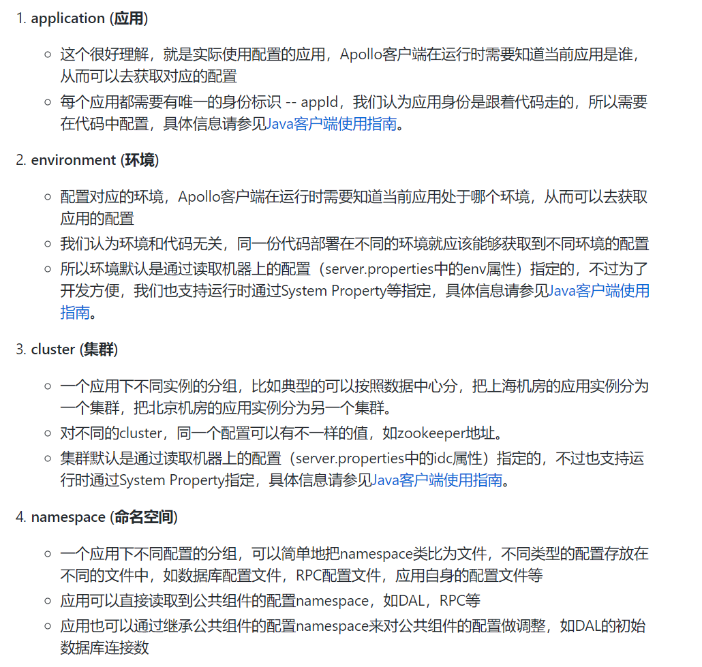

#### 四个核心模块及其主要功能
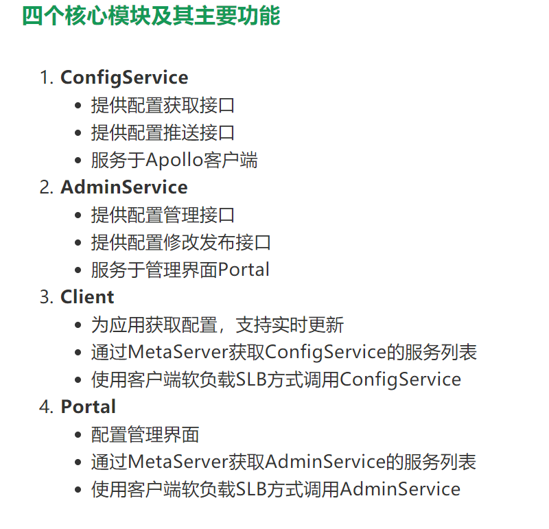

### 架构模块
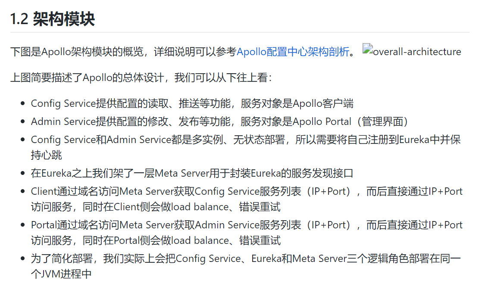

### Config Service
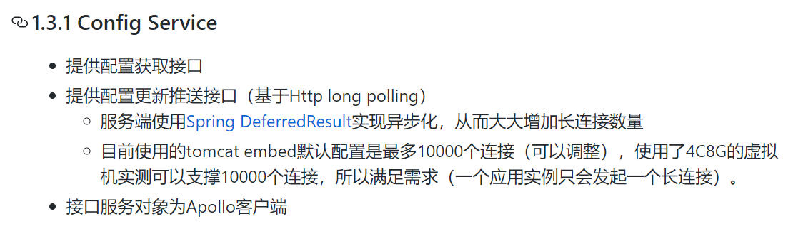

### Admin Service
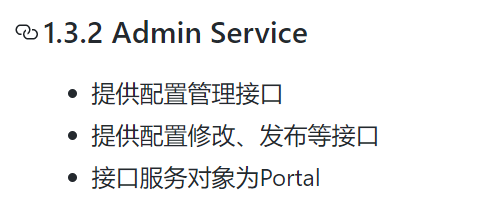

### Meta Server
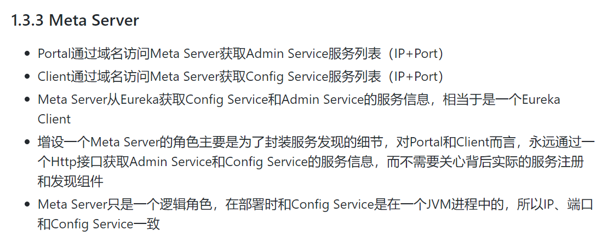

### Eureka
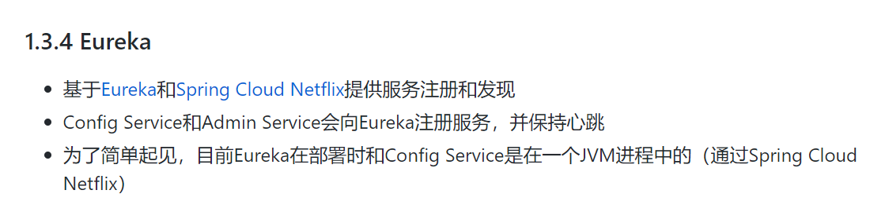

### Portal
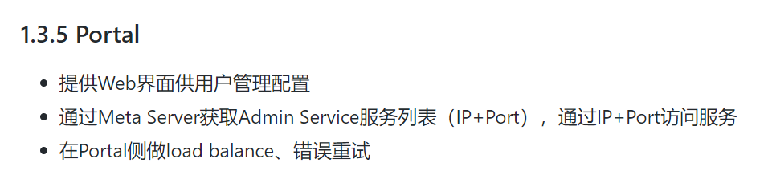

### Client
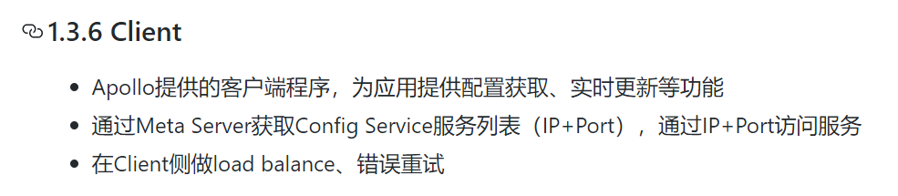


### Meta Server、Config Service、Admin Service、Eureka、Portal、Client的关联关系

> 1.Config Service和Admin Service将自己的ip:port注册到Eureka中

> 2.Meta Server从Eureka中获取Config Service和Admin Service的ip:port列表

> 3.Portal需要设置Meta Server的地址，通过Meta Server可以获取到Admin Service的信息。

> 4.Client需要设置Meta Server的地址，通过Meta Server可以获取到Config Service的信息。

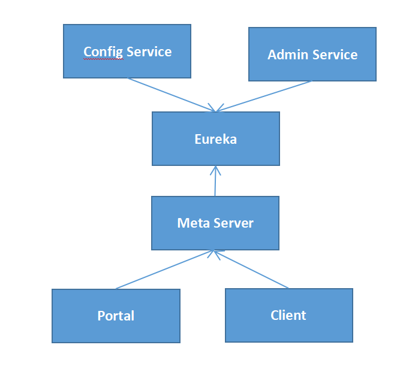


### 部署配置服务器
> 原文: https://github.com/ctripcorp/apollo/wiki/%E5%88%86%E5%B8%83%E5%BC%8F%E9%83%A8%E7%BD%B2%E6%8C%87%E5%8D%97

#### 1.创建ApolloPortalDB
> source /your_local_path/portaldb/V1.0.0__initialization.sql

#### 2.创建ApolloConfigDB
> source /your_local_path/configdb/V1.0.0__initialization.sql

#### 3.调整服务端配置
> 管理员工具 - 系统参数 页面进行配

1.调整ApolloPortalDB配置

|配置项|说明|示例|
|---|---|---|
|apollo.portal.envs|可支持的环境列表|目前只支持四个DEV,FAT,UAT,PRO|
|organizations|部门列表|\[{"orgId":"TEST1","orgName":"样例部门1"},{"orgId":"TEST2","orgName":"样例部门2"}]|
|superAdmin|Portal超级管理员||
|wiki.address|portal上“帮助”链接的地址|默认是Apollo github的wiki首页，可自行设置。|

2.调整ApolloConfigDB配置

|配置项|说明|示例|
|---|---|---|
|eureka.service.url|Eureka服务Url|按照目前的实现，apollo-configservice本身就是一个eureka服务，所以只需要填入apollo-configservice的地址即可，如有多个，用逗号分隔（注意不要忘了/eureka/后缀）。需要注意的是每个环境只填入自己环境的eureka服务地址.|
|namespace.lock.switch|一次发布只能有一个人修改开关，用于发布审核|这是一个功能开关，如果配置为true的话，那么一次配置发布只能是一个人修改，另一个发布。生产环境建议开启此选项|
|config-service.cache.enabled|是否开启配置缓存|这是一个功能开关，如果配置为true的话，config service会缓存加载过的配置信息，从而加快后续配置获取性能。默认为false，开启前请先评估总配置大小并调整config service内存配置。|
|item.key.length.limit|配置项 key 最大长度限制|默认配置是128|
|item.value.length.limit|配置项 value 最大长度限制|默认配置是20000。|

#### 4.下载安装包
> 下载地址：https://github.com/ctripcorp/apollo/releases

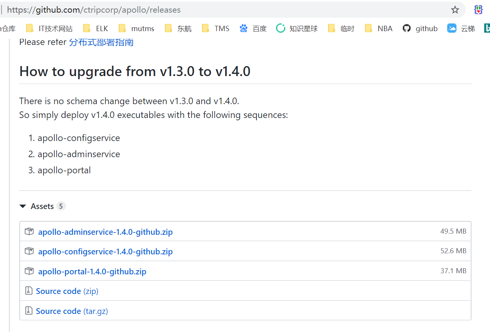

#### 5.配置apollo-configservice
> 修改apollo-configservice-x.x.x-github/config/application-github.properties的数据库配置

```sql
# DataSource
spring.datasource.url = jdbc:mysql://localhost:3306/ApolloConfigDB?useSSL=false&characterEncoding=utf8
spring.datasource.username = someuser
spring.datasource.password = somepwd
```

#### 6.配置apollo-adminservice
> 修改apollo-adminservice-x.x.x-github/config/application-github.properties的数据库配置

```properties
# DataSource
spring.datasource.url = jdbc:mysql://localhost:3306/ApolloConfigDB?useSSL=false&characterEncoding=utf8
spring.datasource.username = someuser
spring.datasource.password = somepwd
```

#### 7.配置apollo-portal
> 修改apollo-portal-x.x.x-github/config/application-github.properties的数据库配置

```properties
# DataSource
spring.datasource.url = jdbc:mysql://localhost:3306/ApolloPortalDB?useSSL=false&characterEncoding=utf8
spring.datasource.username = someuser
spring.datasource.password = somepwd
```

> 配置apollo-portal的meta service信息

> 修改apollo-portal-x.x.x-github/config/apollo-env.properties文件

```properties
dev.meta=http://1.1.1.1:8080
fat.meta=http://apollo.fat.xxx.com
uat.meta=http://apollo.uat.xxx.com
pro.meta=http://apollo.xxx.com
```

#### 8.部署apollo-configservice
> apollo-configservice-x.x.x-github/scripts/startup.sh
> apollo-configservice-x.x.x-github/scripts/shutdown.sh

|命令|说明|
|---|---|
|startup.sh|启动服务|
|shutdown.sh|停止服务|

> 注1：如果需要修改JVM参数，可以修改scripts/startup.sh的JAVA_OPTS部分。
  
> 注2：如要调整服务的日志输出路径，可以修改scripts/startup.sh和apollo-configservice.conf中的LOG_DIR。
  
> 注3：如要调整服务的监听端口，可以修改scripts/startup.sh中的SERVER_PORT。。另外apollo-configservice同时承担meta server职责，如果要修改端口，注意要同时ApolloConfigDB.ServerConfig表中的eureka.service.url配置项以及apollo-portal和apollo-client中的使用到的meta server信息。

#### 9.部署apollo-adminservice
> apollo-adminservice-x.x.x-github/scripts/startup.sh
> apollo-adminservice-x.x.x-github/scripts/shutdown.sh

|命令|说明|
|---|---|
|startup.sh|启动服务|
|shutdown.sh|停止服务|

> 注1：如果需要修改JVM参数，可以修改scripts/startup.sh的JAVA_OPTS部分。

> 注2：如要调整服务的日志输出路径，可以修改scripts/startup.sh和apollo-adminservice.conf中的LOG_DIR。

> 注3：如要调整服务的监听端口，可以修改scripts/startup.sh中的SERVER_PORT。

#### 10.部署apollo-portal
> apollo-portal-x.x.x-github/scripts/startup.sh
> apollo-portal-x.x.x-github/scripts/shutdown.sh

|命令|说明|
|---|---|
|startup.sh|启动服务|
|shutdown.sh|停止服务|

> 注1：如果需要修改JVM参数，可以修改scripts/startup.sh的JAVA_OPTS部分。

> 注2：如要调整服务的日志输出路径，可以修改scripts/startup.sh和apollo-portal.conf中的LOG_DIR。

> 注3：如要调整服务的监听端口，可以修改scripts/startup.sh中的SERVER_PORT。


### Java客户端使用

#### 1.引入apollo-client依赖
```xml
<dependency>
        <groupId>com.ctrip.framework.apollo</groupId>
        <artifactId>apollo-client</artifactId>
        <version>1.1.0</version>
</dependency>
```

#### 2.配置app.id

> Spring Boot application.properties加入app.id

```properties
app.id=YOUR-APP-ID
```

#### 3.配置Apollo Meta Server信息

> Spring Boot application.properties 这种方式不同的环境需要修改apollo.meta地址

方式一：不同的环境需要修改配置，不方便
```properties
apollo.meta=http://config-service-url
```
方式二： 推荐 将环境和代码分离开

```properties
通过server.properties配置文件
可以在server.properties配置文件中指定apollo.meta=http://config-service-url
对于Mac/Linux，文件位置为/opt/settings/server.properties
对于Windows，文件位置为C:\opt\settings\server.properties

```

方式三：历史遗留的方式，不推荐
```properties
通过apollo-env.properties文件
用户也可以创建一个apollo-env.properties，放在程序的classpath下，或者放在spring boot应用的config目录下
使用该配置方式，那么就必须要正确配置Environment
文件内容形如：
dev.meta=http://1.1.1.1:8080
fat.meta=http://apollo.fat.xxx.com
uat.meta=http://apollo.uat.xxx.com
pro.meta=http://apollo.xxx.com
```


#### 4.配置环境信息Environment

```properties
通过配置文件

最后一个推荐的方式是通过配置文件来指定env=YOUR-ENVIRONMENT
对于Mac/Linux，文件位置为/opt/settings/server.properties
对于Windows，文件位置为C:\opt\settings\server.properties

env=DEV

目前，env支持以下几个值（大小写不敏感）：

DEV: Development environment
FAT: Feature Acceptance Test environment
UAT: User Acceptance Test environment
PRO: Production environment
```

#### 5.使用

##### 5.1基于Java的配置（推荐）

```properties
注意@EnableApolloConfig要和@Configuration一起使用，不然不会生效。

1.注入默认namespace的配置到Spring中

//这个是最简单的配置形式，一般应用用这种形式就可以了，用来指示Apollo注入application namespace的配置到Spring环境中
@Configuration
// 默认加载application namespace的配置
@EnableApolloConfig
// 指定多个配置文件及顺序
// @EnableApolloConfig(value = {"FX.apollo", "application.yml"}, order = 1)
public class AppConfig {
  @Bean
  public TestJavaConfigBean javaConfigBean() {
    return new TestJavaConfigBean();
  }
}
```

##### 5.2 Spring Boot集成方式（推荐）

```properties
# will inject 'application' namespace in bootstrap phase
apollo.bootstrap.enabled = true
# will inject 'application', 'FX.apollo' and 'application.yml' namespaces in bootstrap phase
apollo.bootstrap.namespaces = application,FX.apollo,application.yml

```

|配置项|说明|示例|
|---|---|---|
|apollo.bootstrap.enabled|是否启用apollo配置|apollo.bootstrap.enabled = true|
|apollo.bootstrap.namespaces|指定要加载的配置文件列表，默认加载application namespace的配置|apollo.bootstrap.namespaces = application,FX.apollo,application.yml|
|apollo.bootstrap.eagerLoad.enabled|将Apollo配置加载提到初始化日志系统之前(1.2.0+), 如果希望把日志相关的配置（如logging.level.root=info或logback-spring.xml中的参数）也放在Apollo管理，那么可以额外配置apollo.bootstrap.eagerLoad.enabled=true来使Apollo的加载顺序放到日志系统加载之前，不过这会导致Apollo的启动过程无法通过日志的方式输出(因为执行Apollo加载的时候，日志系统压根没有准备好呢！所以在Apollo代码中使用Slf4j的日志输出便没有任何内容).|apollo.bootstrap.eagerLoad.enabled=true|
|apollo.autoUpdateInjectedSpringProperties|placeholder在运行时是否自动更新|默认true|


